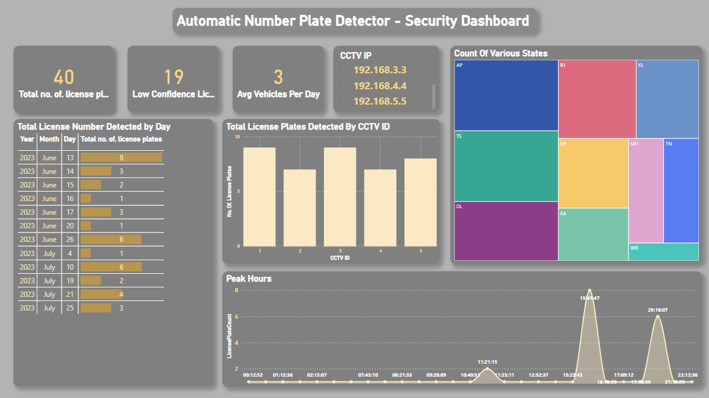
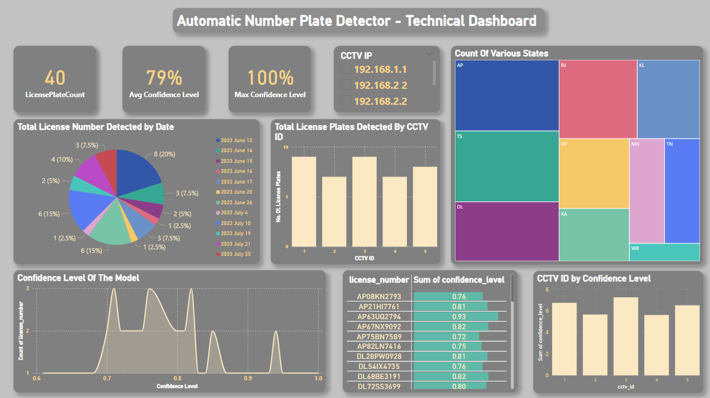

# Power BI Dashboard for ANPR Data Analysis

## Description

This repository showcases a Power BI dashboard for analyzing data collected from the Automatic Number Plate Recognition (ANPR) system. The dashboard provides insights and visualizations based on a sample dataset of 40 records extracted from the PostgreSQL database. It aims to help users understand and explore the ANPR data efficiently, making data-driven decisions based on the analysis.

## Features and Functionality

- Interactive Visualizations: The Power BI dashboard offers interactive charts and visualizations to explore ANPR data dynamically.
- ANPR Data Analysis: Gain insights into vehicle count, peak hours, entry/exit points, and more from the ANPR data.
- Filter and Slicers: Utilize filter and slicer options to customize the dashboard and focus on specific data segments.
- Real-Time Data: The dashboard is updated with the latest data, ensuring real-time analysis and decision-making.

## Data Source and Sample Data

- Data Source: The ANPR data used in this dashboard is collected from the PostgreSQL database, which is connected to the ANPR system.
- Sample Data: A sample dataset of 40 records is provided in this repository. You can find the data in the `Data` folder along with the data schema in `Detections.csv`.

## Installation and Setup

1. Clone this repository to your local machine: git clone https://github.com/mukeshsundar23/ANPR-Dashboard.git

2. Install Power BI Desktop on your computer if you haven't already.

3. Open Power BI Desktop and click on "Open" to navigate to the cloned repository directory.

4. Select the main Power BI file (e.g., `ANPR.pbix`) to open the dashboard.

5. Once the dashboard is loaded, you can start exploring the ANPR data using the interactive visualizations.

## Screenshots

## Contact

If you have any questions or need assistance, feel free to contact me at [mukeshsundar2362004@gmail.com](mailto:mukeshsundar2362004@gmail.com).

